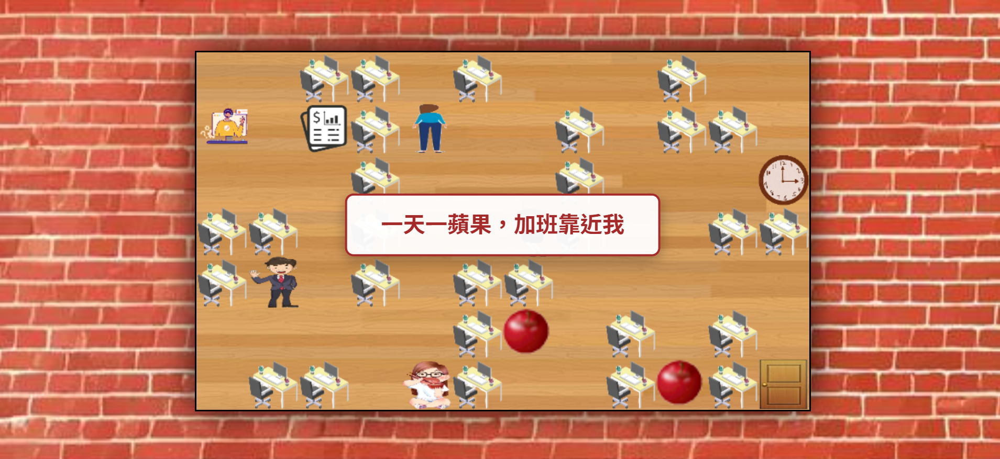
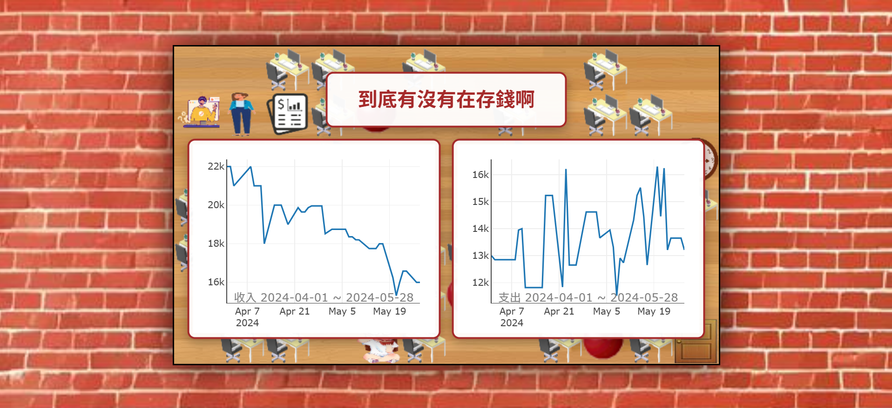
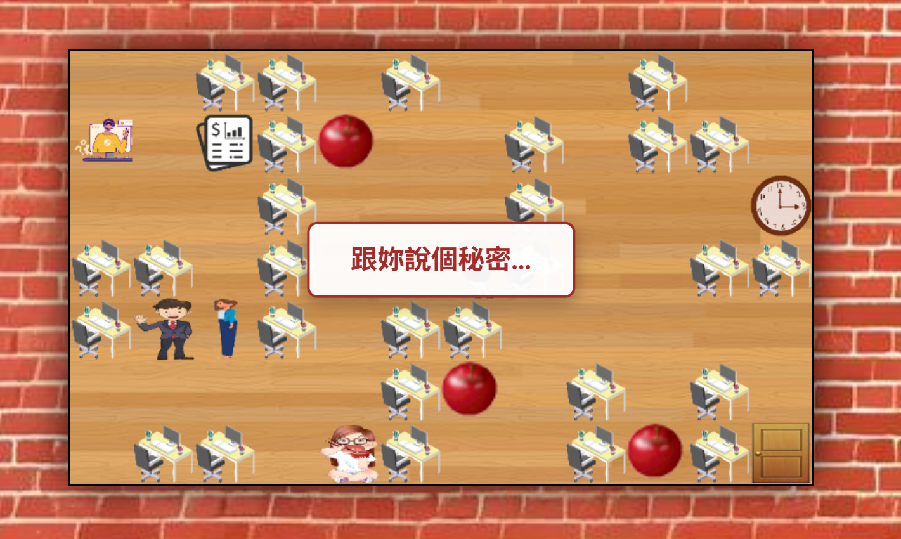
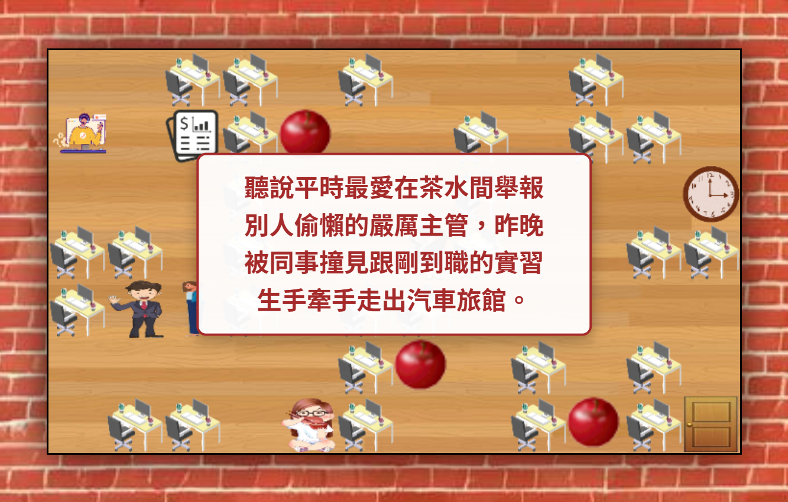

# 🎮 逃離職場 RPG 

> 結合 2D 網頁互動、資料視覺化與生成式 AI 的角色扮演遊戲。

🔗 **[點此立即遊玩 (Live Demo)](https://website-design-nhvi.onrender.com/)**

## Introduction
「逃離職場」是一個基於 Flask 開發的互動式網頁遊戲（期末專題作品）。玩家將扮演一名渴望準時下班的員工，在辦公室地圖中探索。透過與 NPC 互動、觸發隨機事件，以及檢視業務數據報表，想辦法在壓力爆表前找到出口！

[遊戲簡報](./RPG.pptx.pdf)

## Screenshots

  
  
<em>▲ 玩家在辦公室地圖中自由探索，尋找逃離的出口</em>

  
  
<em>▲ Plotly 數據視覺化</em>

  
  
  
<em>▲ Gemini AI 的動態對話系統</em>

## Core Features
* **AI 驅動對話 (Generative AI):** 介接 Google Gemini API (gemini-3.6-flash)，NPC 的對話與辦公室八卦皆為即時動態生成，每次遊玩都有不同驚喜。
* **數據視覺化 (Data Visualization):** 整合 Plotly 與 Pandas，將 CSV 業務數據轉化為互動式圖表，融入遊戲情境。
* **2D 網頁遊戲引擎:** 使用 HTML5 Canvas 與 Vanilla JavaScript 打造順暢的網格移動系統、碰撞偵測與事件觸發機制。
* **雲端部署:** 完整部署於 Render 雲端平台，並實作環境變數以確保 API 金鑰安全。

## System Architecture
* **後端:** Python, Flask, Gunicorn
* **前端:** HTML5, CSS3, JavaScript (Canvas API)
* **資料處理與視覺化:** Pandas, Plotly
* **AI 模型:** Google Gemini API 
* **部署:** Render
